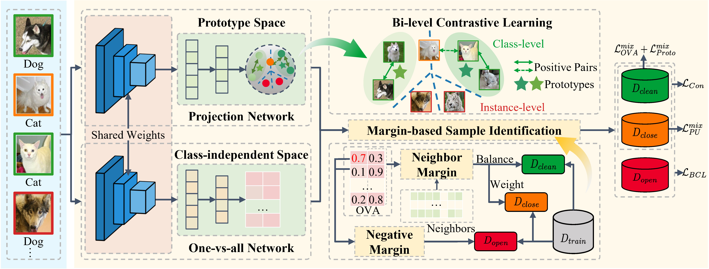

# [Learning with Open-world Noisy Data via Class-independent Margin in Dual Representation Space](https://arxiv.org/abs/2501.11053)

**Abstract:** Learning with Noisy Labels (LNL) aims to improve the model generalization when facing data with noisy labels, and existing methods generally assume that noisy labels come from known classes, called closed-set noise. However, in real-world scenarios, noisy labels from similar unknown classes, i.e., open-set noise, may occur during the training and inference stage. Such open-world noisy labels may significantly impact the performance of LNL methods. In this study, we propose a novel dual-space joint learning method to robustly handle the open-world noise. To mitigate model overfitting on closed-set and open-set noises, a dual representation space is constructed by two networks. One is a projection network that learns shared representations in the prototype space, while the other is a One-Vs-All (OVA) network that makes predictions using unique semantic representations in the class-independent space. Then, bi-level contrastive learning and consistency regularization are introduced in two spaces to enhance the detection capability for data with unknown classes. To benefit from the memorization effects across different types of samples, class-independent margin criteria are designed for sample identification, which selects clean samples, weights closed-set noise, and filters open-set noise effectively. Extensive experiments demonstrate that our method outperforms the state-of-the-art methods and achieves an average accuracy improvement of 4.55\% and an AUROC improvement of 6.17\% on CIFAR80N.

# Pipeline



# Installation

```shell
pip install -r requirements.txt
```

# Datasets

The effectiveness of our method is evaluated on closed-world noiy data (i.e., CIFAR100N), open-world noisy data (i.e., CIFAR80N), and real-world noisy data (i.e., Web-Aircraft, Web-Car, and Web-Bird). The CIFAR100N and CIFAR80N datasets are generated based on CIFAR100. In the open-world noisy dataset CIFAR80N, the last 20 categories in CIFAR100 are regarded as the unknown classes. They contain both symmetric and asymmetric types of noise with specified noise rates. For web datasets, they are collected via image search engines, inevitably resulting in unknown noise rates and complex noise types.

You can download the CIFAR10 and CIFAR100 datasets from [here](https://www.cs.toronto.edu/~kriz/cifar.html).

You can download the web datasets from [here](https://github.com/NUST-Machine-Intelligence-Laboratory/weblyFG-dataset).

# Usage

```shell
bash scripts/our.sh -g 3 -d cifar80no -n symmetric -c 0.8 -k 1
```

# License

This project is licensed under the MIT License. See the [LICENSE](LICENSE) file for details.

# Citation
If you find this code useful in your research, please consider citing our paper:

```bibtex
@inproceedings{pan2025learning,
  title={Learning with Open-world Noisy Data via Class-independent Margin in Dual Representation Space},
  author = {Linchao Pan and Can Gao and Jie Zhou and Jinbao Wang},
  booktitle={Proceedings of the AAAI Conference on Artificial Intelligence (AAAI)},
  year={2025}
}
```

# Acknowledgments

This project is built on the following repositories:
- [SED](https://github.com/shengmengmeng/SED)
- [NPN](https://github.com/NUST-Machine-Intelligence-Laboratory/NPN)

Thanks to the authors for their great work!